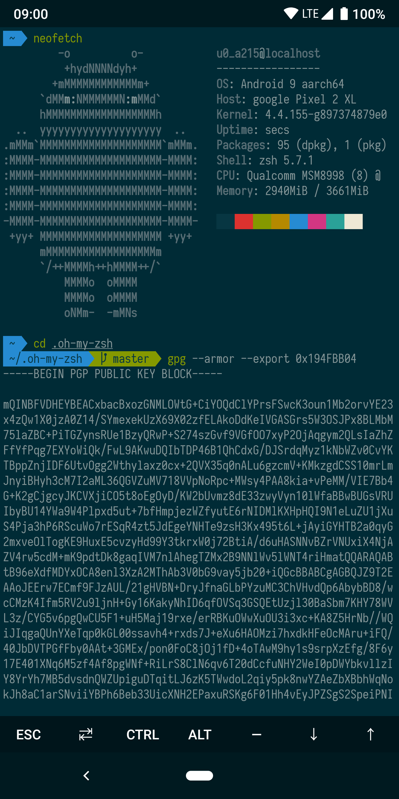

# Termux-ohmyzsh

A fork from [oh-my-termux](https://github.com/4679/oh-my-termux) 。让你的 Termux 变得五颜六色～

为 Termux 添加 [oh-my-zsh](https://github.com/robbyrussell/oh-my-zsh) 终端环境，启用 [zsh-syntax-highlighting](https://github.com/zsh-users/zsh-syntax-highlighting) 以及 [zsh-autosuggestions](https://github.com/zsh-users/zsh-autosuggestions)，设置色彩样式（大部分来自 [Gogh](https://github.com/Mayccoll/Gogh)）和 Powerline 字体（来自 [powerline/fonts](https://github.com/powerline/fonts)）。oh-my-zsh 主题默认为 agnoster，颜色样式默认为 Solarized Dark，字体默认为 Iosevka。

**此 Repo 使用 Termux 官方源，在中国大陆可能需要将 Termux 应用添加到代理列表。**

## 使用

```shell
sh -c "$(curl -fsSL https://github.com/zyw271828/termux-ohmyzsh/raw/master/install.sh)"
```

## 设置色彩样式

运行 `chcolor` 更换色彩样式，或者：

```shell
~/.termux/colors.sh
```

## 设置字体

运行 `chfont` 更换字体，或者：

```shell
~/.termux/fonts.sh
```

## 需要软件包

- curl

## 恢复到安装前的环境

1. 在 home 目录下可找到按日期命名的 zshrc 备份文件，形如 `.zshrc.bak.2018.1.1-00:00:00`，将其文件名恢复为 `.zshrc`。若不存在备份文件，删除当前的 `.zshrc`。

2. 在 home 目录下可找到按日期命名的 termux 备份配置目录，形如 `.termux.bak.2018.1.1-00:00:00`，将其文件名恢复为`.termux`。若不存在备份，删除当前的 `.termux` 目录。

3. 重启 termux

## 使用提示（参照 Termux Wiki）

要调整字体大小，双指缩放即可。另外，Termux 使用音量键模拟一些 shell 功能：

- `音量减+C`：即 `Ctrl+C`，SIGINT 中断 shell 当前进程
- `音量减+D`：即 `Ctrl+D`，EOF 登出当前 shell
- `音量减+E`：即 `Ctrl+E`，移动 shell 光标至行尾
- `音量减+L`：即 `Ctrl+L`，清除屏幕内容
- `音量减+Z`：即 `Ctrl+Z`，SIGTSTP 暂停 shell 中当前进程

其他一些按键可以使用 `音量加+Q` 调出快捷小键盘，也可使用下列组合：

- `音量加+W`，`音量加+A`，`音量加+S`，`音量加+D`：移动光标上下左右
- `音量加+E`：ESC
- `音量加+T`：TAB
- `音量加+数字`：F1-F9，F10 使用数字 0
- `音量加+L`：管道符 “|”
- `音量加+H`：波浪符 “~"
- `音量加+U`：下划线 “_”
- `音量加+V`：控制音量

如需更好的打字输入支持，在 `音量加+Q` 的小键盘上向左滑动即可

## 示例

Solarized Dark 配色方案 + oh-my-zsh agnoster 主题 + Iosevka 字体：

<p align="center"></p>
